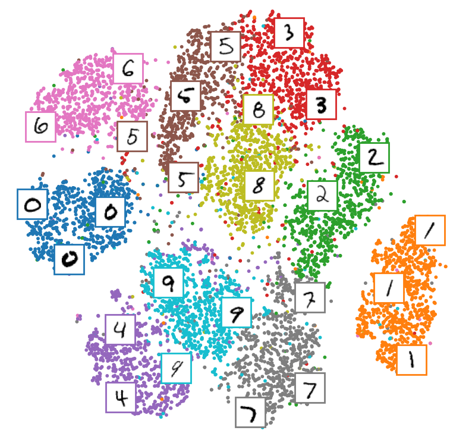
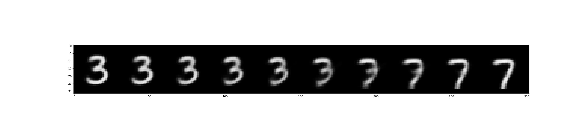

# Variational Autoencoder (VAE)
## 설명
Variational autoencoder (VAE)는 새로운 데이터를 생성을 목표로하는 생성 모델입니다.
GAN (generative adversarial network) 이전에 등장한 생성 모델이며, 수학적 이론이 잘 뒷받쳐주는 알고리즘입니다. 그리고 autoencoder (AE)와 이름은 비슷하지만 manifold learning을 위한 모델인 AE와는 전혀 연관성이 없는 모델입니다. 본 코드에서는 vanilla VAE의 코드를 확인할 수 있으며, MNIST 데이터의 경우 학습 결과로 나온 잠재 변수(latent variable)를 t-SNE를 통해 가시화 합니다. 추가로 latent space가 천천히 변화함에 따라 VAE를 통해 생성되는 이미지가 어떻게 바뀌는지 살펴봅니다. VAE에 관한 설명은 [Variational Autoencoder (VAE)](https://ljm565.github.io/contents/VAE1.html)를 참고하시기 바랍니다.
<br><br><br>

## 모델 종류
* ### Vanilla VAE
    Linear layer를 사용한 vanilla VAE가 구현되어 있습니다.
<br><br><br>

## 사용 데이터
* 실험으로 사용하는 데이터는 [Yann LeCun, Corinna Cortes의 MNIST](http://yann.lecun.com/exdb/mnist/) 데이터입니다.
* 학습 데이터의 경로를 설정하여 사용자가 가지고 있는 데이터도 학습 가능합니다.
<br><br><br>


## 사용 방법
* ### 학습 방법
    학습을 시작하기 위한 argument는 4가지가 있습니다.<br>
    * [-d --device] {cpu, gpu}, **필수**: 학습을 cpu, gpu로 할건지 정하는 인자입니다.
    * [-m --mode] {train, test}, **필수**: 학습을 시작하려면 train, 학습된 모델을 가지고 있어서 가시화 혹은 결과를 보고싶은 경우에는 test로 설정해야합니다. test를 사용할 경우, [-n, --name] 인자가 **필수**입니다.
    * [-c --cont] {1}, **선택**: 학습이 중간에 종료가 된 경우 다시 저장된 모델의 체크포인트 부분부터 학습을 시작할 수 있습니다. 이 인자를 사용할 경우 -m train 이어야 합니다. 
    * [-n --name] {name}, **선택**: 이 인자는 -c 1 혹은 -m test 경우 사용합니다.
    중간에 다시 불러서 학습을 할 경우 모델의 이름을 입력하고, test를 할 경우에도 test 할 모델의 이름을 입력해주어야합니다(최초 학습시 config.json에서 정한 모델의 이름의 폴더가 형성되고 그 폴더 내부에 모델 및 모델 파라미터가 json 파일로 형성 됩니다).<br><br>

    터미널 명령어 예시<br>
    * 최초 학습 시
        ```
        python3 main.py -d cpu -m train
        ```
    * 중간에 중단 된 모델 이어서 학습 시
        <br>주의사항: config.json을 수정해야하는 일이 발생 한다면 base_path/config.json이 아닌, base_path/model/{model_name}/{model_name}.json 파일을 수정해야 합니다.
        ```
        python3 main.py -d gpu -m train -c 1 -n {model_name}
        ```
    * 학습 된 모델 결과 볼 때
        <br>주의사항: config.json을 수정해야하는 일이 발생 한다면 base_path/config.json이 아닌, base_path/model/{model_name}/{model_name}.json 파일을 수정해야 수정사항이 반영됩니다.
        ```
        python3 main.py -d cpu -m test -n {model_name}
        ```
    <br><br>

* ### 모델 학습 조건 설정 (config.json)
    **주의사항: 최초 학습 시 config.json이 사용되며, 이미 한 번 학습을 한 모델에 대하여 parameter를 바꾸고싶다면 base_path/model/{model_name}/{model_name}.json 파일을 수정해야 합니다.**

    * ### MNIST 데이터 사용 시
        * MNIST_train: {0, 1} 중 선택, 0인 경우 사용자 지정 데이터, 1인 경우 MNIST 데이터 학습.
        * MNIST_valset_proportion: **MNIST를 학습할 때 사용됨.** 학습 모델을 저장하기 위한 지표로 사용 될 valset을 trainset에 대해 설졍한 비율로 랜덤하게 선택(e.g. 0.2인 경우, 10,000개의 trainset 중 20 %를 valset, 나머지 80 %를 trainset으로 분리하여 학습).
        <br><br>
    
    * ### 사용자 지정 데이터 사용 시
        * 사용자 지정 데이터 경로가 하나일 때(train/val/test set 구분이 없을 때)
            * custom_data_proportion: train/val/test 데이터 split 비율 설정(e.g. [0.7, 0.2, 0.1]), **비율 합이 1이 되어야 함.**
            * two_folders: 상관 없음.
            * train_data_path: 학습에 사용할 데이터가 있는 경로.
            * val_data_path: 상관 없음.
            * test_data_path: 상관 없음.
            <br><br>

        * 사용자 지정 데이터가 2개로 나눠져 있을 때(e.g train/test set) val set 생성
            * custom_data_proportion: 하나의 경로에 있는 데이터를 나눌 비율 설정(e.g. [0.7, 0.3]), **비율 합이 1이 되어야 함.**
            * two_folders: ['train', 'val'], ['val', 'test'] 둘 중 하나로 설정.
                * ['train', 'val']: train_data_path 에 있는 데이터를 custom_data_proportion에 맞춰서 train/val set으로 split.
                * ['val', 'test']: test_data_path 에 있는 데이터를 custom_data_proportion에 맞춰서 val/test set으로 split.
            * train_data_path: 학습에 사용할 데이터가 있는 경로.
            * val_data_path: 상관 없음.
            * test_data_path: 모델 결과를 테스트할 때 사용할 데이터가 있는 경로.
            <br><br>

        * 사용자 지정 데이터가 train/val/test set으로 모두 나눠져있을 때
            * custom_data_proportion: [1]로 설정.
            * two_folders: 상관 없음.
            * train_data_path: 학습에 사용할 데이터가 있는 경로.
            * val_data_path: validatin 할 때 사용할 데이터가 있는 경로.
            * test_data_path: 모델 결과를 테스트할 때 사용할 데이터가 있는 경로.
            <br><br>


    * base_path: 학습 관련 파일이 저장될 위치.
    * model_name: 학습 모델이 저장될 파일 이름 설정. 모델은 base_path/model/{model_name}/{model_name}.pt 로 저장.
    * data_name: 학습 데이터 이름 설정. base_path/{data_name}/ 내부에 train.pkl, val.pkl, test.pkl 파일로 저장. 전처리 등 시간 절약을 위해 이후 같은 data_name을 사용할 시 저장된 데이터를 불러서 사용(사용자 지정 데이터 사용시 data 폴더 생성). 
    * loss_data_name: 학습 시 발생한 loss data를 저장하기 위한 이름 설정. base_path/loss/{loss_data_name}.pkl 파일로 저장. 내부에 중단된 학습을 다시 시작할 때, 학습 과정에 발생한 loss 데이터를 그릴 때 등 필요한 데이터를 dictionary 형태로 저장.
    * color_channel: 학습에 사용되는 데이터가 흑백이면 1, 칼라면 3으로 설정(MNIST 사용 시 1로 설정).
    * hieght, width: 데이터의 전 처리 할 크기를 지정(MNIST 학습의 경우 코드 내에서 크기가 28 * 28로 자동 변환)
    * convert2grayscale: {0, 1} 중 선택, color_channel = 3 일때만 작동. 칼라 데이터를 흑백 데이터로 변경하고싶을 때 1, 칼라로 유지하고싶을 때 0으로 설정.
    * batch_size: batch size 지정.
    * epochs: 학습 epoch 지정.
    * lr: learning rate 지정.
    * hidden_dim: vanilla VAE의 hidden layer 차원 지정.
    * latent_dim: vanilla VAE의 잠재 변수(latent variable) 차원 설정.
    * dropout: vanilla VAE의 학습 과정 시 overfitting(과적합) 방지를 위한 dropout 비율 설정.
    <br><br>

    * ### 모델 학습 결과 가시화 관련
        * result_num: 확인하고자 하는 VAE의 복구 결과 이미지 수. 랜덤으로 test set 중 설정한 result_num 수 만큼 추출하여 결과 이미지를 보여줌.
        * result_img_name: 위의 결과를 저장할 이미지 파일 이름. result/{result_img_name} 으로 저장.
        * visualization_tsne: {0, 1} 중 선택. t-SNE를 통한 test set의 latent variable을 가시화 하려면 1, 아니면 0으로 설정(현재 label 데이터가 있는 MNIST 데이터에 대해서만 가시화, 사용자 지정 데이터의 label이 있다면 train.py의 test 함수 코드를 수정하여 사용, 즉 MNIST_train = 1 이어야 함).
        * visualization_tsne_img_name: 위에서 t-SNE를 가시화 한다면, 그 결과를 저장할 이미지 파일 이름. result/{visualization_img_name} 으로 저장.
        * walking_latent_space: {0, 1} 중 선택. MNIST 두 개의 숫자를 대표하는 잠재 변수를 interpolate 할 때 생성되는 데이터 가시화 하려면 1, 아니면 0.
        * walking_latent_space_img_name: 잠재 변수 interpolate에 따른 생성 데이터 결과를 저장할 파일 이름. result/{walking_latent_space_img_name} 으로 저장.
        * numbers (e.g. [5, 9]): Interpolate 할 잠재 변수들의 대상 숫자 2개설정. 
        <br><br><br>


## 결과
* VAE 결과<br><br>
<br><br>
* t-SNE를 통한 VAE 잠재 변수 가시화 결과<br><br>
<br><br>
* 3, 7 잠재 변수 변화에 따른 생성 데이터 가시화(Walking in latent space)<br><br>

<br><br><br>

