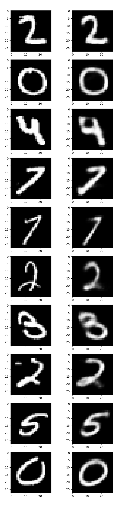
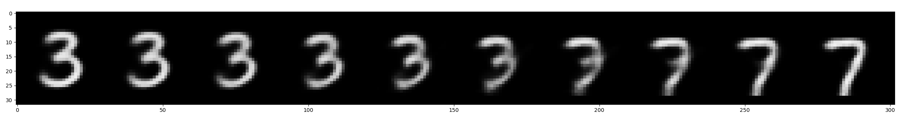

# Variational Autoencoder (VAE)
한국어 버전의 설명은 [여기](./docs/README_ko.md)를 참고하시기 바랍니다.

## Introduction
A Variational Autoencoder (VAE) is a generative model aimed at creating new data.
It is a generative model that predates GANs (generative adversarial networks) and is supported by solid mathematical theory. 
Although it shares a similar name with autoencoders (AE), which are models for manifold learning, it is entirely unrelated to AEs.
This code includes an implementation of a vanilla VAE, and for the MNIST dataset, it visualizes the latent variables (resulting from training) using t-SNE.
Additionally, it examines how the images generated by the VAE change as the latent space gradually varies. 
For an explanation of VAEs, refer to [Variational Autoencoder (VAE)](https://ljm565.github.io/contents/VAE1.html).
<br><br><br>

## Supported Models
### Vanilla VAE
* A vanilla variational autoencoder using `nn.Linear` is implemented.
<br><br><br>

## Base Dataset
* Base dataset for tutorial is [MNIST](http://yann.lecun.com/exdb/mnist/).
* Custom datasets can also be used by setting the path in the `config/config.yaml`.
However, implementing a custom dataloader may require additional coding work in `src/utils/data_utils.py`.
<br><br><br>

## Supported Devices
* CPU, GPU, multi-GPU (DDP), MPS (for Mac and torch>=1.12.0)
<br><br><br>

## Quick Start
```bash
python3 src/run/train.py --config config/config.yaml --mode train
```
<br><br>

## Project Tree
This repository is structured as follows.
```
├── configs                         <- Folder for storing config files
│   └── *.yaml
│
└── src      
    ├── models
    |   └── vae.py                  <- VAE model file
    |
    ├── run                   
    |   ├── latent_visualization.py <- Generated data visualization codes through the trained model
    |   ├── train.py                <- Training execution file
    |   └── validation.py           <- Trained model evaulation execution file
    | 
    ├── tools                   
    |   ├── model_manager.py          
    |   └── training_logger.py      <- Training logger class file
    |
    ├── trainer                 
    |   ├── build.py                <- Codes for initializing dataset, dataloader, etc.
    |   └── trainer.py              <- Class for training, evaluating, and visualizing with t-SNE
    |
    └── uitls                   
        ├── __init__.py             <- File for initializing the logger, versioning, etc.
        ├── data_utils.py           <- File defining the custom dataset dataloader
        ├── filesys_utils.py       
        └── training_utils.py     
```
<br><br>

## Tutorials & Documentations
Please follow the steps below to train the VAE.

1. [Getting Started](./docs/1_getting_started.md)
2. [Data Preparation](./docs/2_data_preparation.md)
3. [Training](./docs/3_trainig.md)
4. ETC
   * [Evaluation](./docs/4_model_evaluation.md)
   * [Generated Data Visualization](./docs/5_generated_data_visualization.md)

<br><br><br>

## Training Results
* Resutls of VAE<br><br>
<br><br>
* Latent space visualization via t-SNE<br><br>
<br><br>
* Visualization of generated data as latent variables 3 and 7 change (Walking in latent space)<br><br>

<br><br><br>

