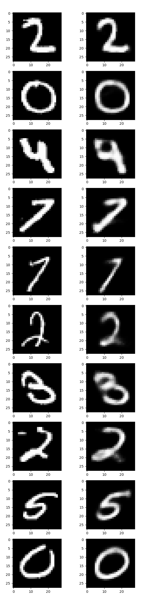
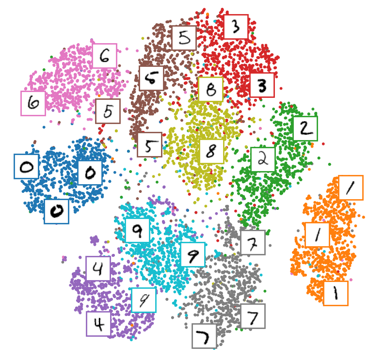
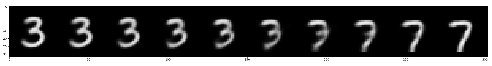

# Variational Autoencoder (VAE)

## Introduction
Variational autoencoder (VAE)는 새로운 데이터를 생성을 목표로하는 생성 모델입니다.
GAN (generative adversarial network) 이전에 등장한 생성 모델이며, 수학적 이론이 잘 뒷받쳐주는 알고리즘입니다. 그리고 autoencoder (AE)와 이름은 비슷하지만 manifold learning을 위한 모델인 AE와는 전혀 연관성이 없는 모델입니다. 본 코드에서는 vanilla VAE의 코드를 확인할 수 있으며, MNIST 데이터의 경우 학습 결과로 나온 잠재 변수(latent variable)를 t-SNE를 통해 가시화 합니다. 추가로 latent space가 천천히 변화함에 따라 VAE를 통해 생성되는 이미지가 어떻게 바뀌는지 살펴봅니다. VAE에 관한 설명은 [Variational Autoencoder (VAE)](https://ljm565.github.io/contents/VAE1.html)를 참고하시기 바랍니다.
<br><br><br>

## Supported Models
### Vanilla VAE
* `nn.Linear`를 사용한 vanilla VAE가 구현되어 있습니다.
<br><br><br>

## Base Dataset
* 튜토리얼로 사용하는 기본 데이터는 [Yann LeCun, Corinna Cortes의 MNIST](http://yann.lecun.com/exdb/mnist/) 데이터입니다.
* `config/config.yaml`에 학습 데이터의 경로를 설정하여 사용자가 가지고 있는 custom 데이터도 학습 가능합니다.
다만 `src/utils/data_utils.py`에 custom dataloader 코드를 구현해야할 수도 있습니다.
<br><br><br>

## Supported Devices
* CPU, GPU, multi-GPU (DDP), MPS (for Mac and torch>=1.12.0)
<br><br><br>

## Quick Start
```bash
python3 src/run/train.py --config config/config.yaml --mode train
```
<br><br>

## Project Tree
본 레포지토리는 아래와 같은 구조로 구성됩니다.
```
├── configs                         <- Config 파일들을 저장하는 폴더
│   └── *.yaml
│
└── src      
    ├── models
    |   └── vae.py                  <- VAE 모델 파일
    |
    ├── run                   
    |   ├── latent_visualization.py <- 학습된 모델로 생성한 이미지 가시화 코드
    |   ├── train.py                <- 학습 실행 파일
    |   └── validation.py           <- 학습된 모델 평가 실행 파일
    | 
    ├── tools                   
    |   ├── model_manager.py          
    |   └── training_logger.py      <- Training logger class 파일
    |
    ├── trainer                 
    |   ├── build.py                <- Dataset, dataloader 등을 정의하는 파일
    |   └── trainer.py              <- 학습, 평가, t-SNE 가시화 수행 class 파일
    |
    └── uitls                   
        ├── __init__.py             <- Logger, 버전 등을 초기화 하는 파일
        ├── data_utils.py           <- Custom dataloader 파일
        ├── filesys_utils.py       
        └── training_utils.py     
```
<br><br>


## Tutorials & Documentations
오토인코더 모델 학습을 위해서 다음 과정을 따라주시기 바랍니다.

1. [Getting Started](./1_getting_started_ko.md)
2. [Data Preparation](./2_data_preparation_ko.md)
3. [Training](./3_trainig_ko.md)
4. ETC
   * [Evaluation](./4_model_evaluation_ko.md)
   * [Generated Data Visualization](./5_generated_data_visualization_ko.md)
<br><br><br>


## Training Results
* VAE 결과<br><br>
<br><br>
* t-SNE를 통한 VAE 잠재 변수 가시화 결과<br><br>
<br><br>
* 3, 7 잠재 변수 변화에 따른 생성 데이터 가시화(Walking in latent space)<br><br>

<br><br><br>

